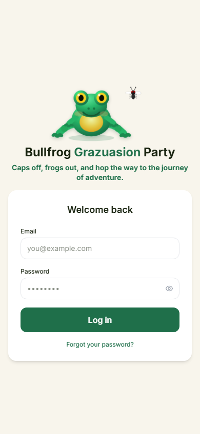
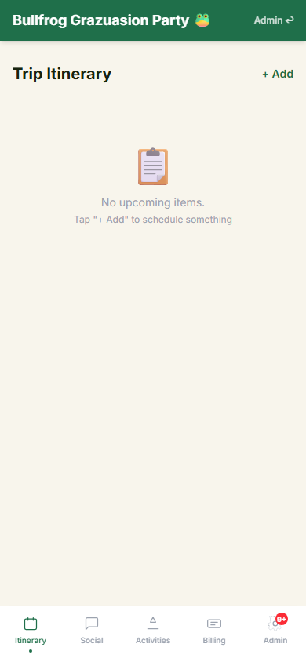
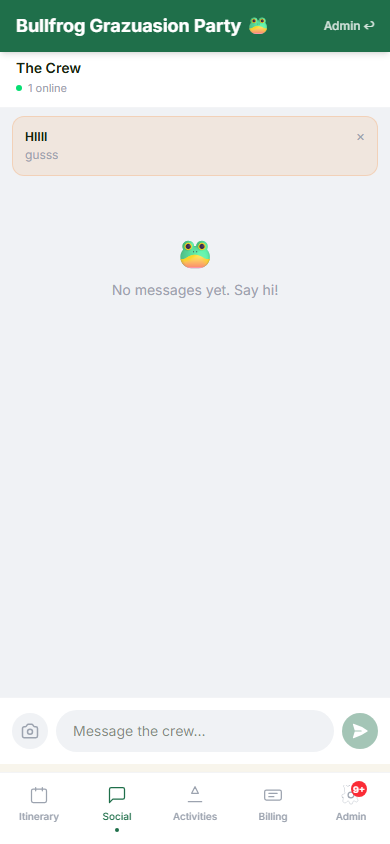
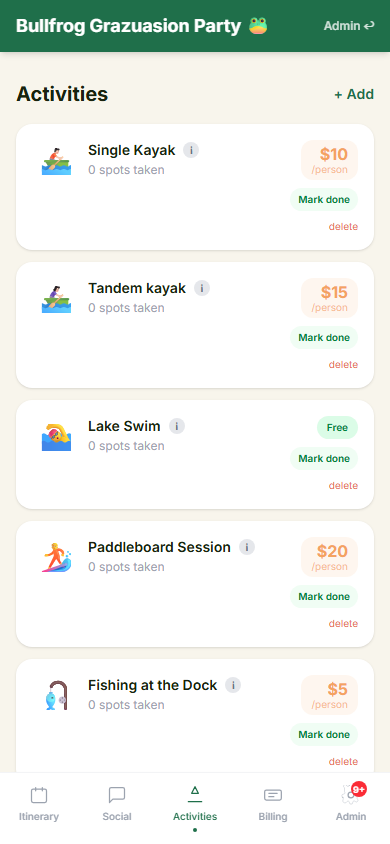
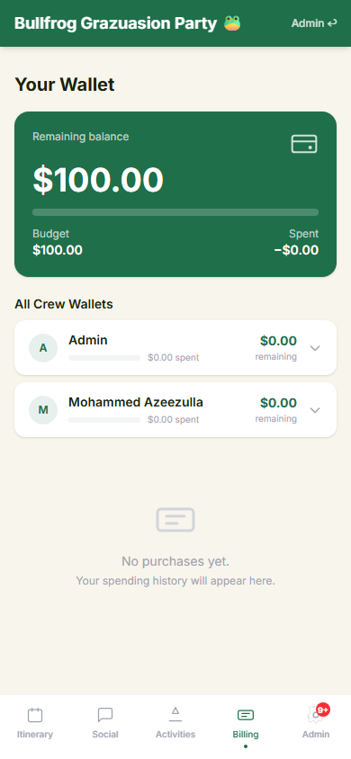

<div align="center">

# 🐸 Bullfrog Bash

### A self-hosted group trip app — built for friends, not enterprises.

*Invite your crew by email. Share the itinerary. Book activities. Split expenses. Chat in real-time. All in one link.*

<br/>


</div>

---

## What is this?

**Bullfrog Bash** is a purpose-built mobile web app for organizing a group trip with friends. No Notion doc juggling, no group-chat chaos, no Venmo math at 2am.

Fork it. Drop in your trip name and dates. Deploy in 20 minutes. Send one link to your crew.

> Built for the **Bullfrog Grazuasion Party** — a 3-day lake trip for 16 friends. Rename everything and it works for yours.

---

## Screenshots

<div align="center">
<table>
  <tr>
    <td align="center"><b>Login</b></td>
    <td align="center"><b>Itinerary</b></td>
    <td align="center"><b>Group Chat</b></td>
  </tr>
  <tr>
    <td></td>
    <td></td>
    <td></td>
  </tr>
  <tr>
    <td align="center"><b>Activities</b></td>
    <td align="center"><b>Wallet & Billing</b></td>
    <td align="center"></td>
  </tr>
  <tr>
    <td></td>
    <td></td>
    <td></td>
  </tr>
</table>
</div>

---

## Features

| | Feature | Details |
|---|---|---|
| 🗓️ | **Trip Itinerary** | Admin builds a schedule. Email reminders fire 60 min before each item. |
| 💬 | **Real-Time Group Chat** | Socket.io chat with image + caption support and 🐸 emoji reactions. |
| 🏊 | **Bookable Activities** | Admin creates activities with price/person. Users request spots. Admin approves. Billing auto-deducted when marked done. |
| 💳 | **Wallet & Expense Tracking** | Per-person budget pool. Expense splits (equal or custom). Live balance with pending charges shown. |
| 📣 | **Announcements** | Admin broadcasts pinned messages that appear at the top of the social tab. |
| 🔔 | **Live Notifications** | Real-time badge + toast on admin tab when someone requests a spot or joins. |
| 🔐 | **Invite-Only Auth** | JWT + refresh tokens. Email allowlist — only approved addresses can sign up. Forgot/reset password via email. |
| 👑 | **Admin Panel** | Manage crew, wallet balances, itinerary, activities, expenses, and send announcements — all from one tabbed panel. |
| 📱 | **Mobile-First** | Designed for phones. Renders as a full-screen PWA feel on iOS and Android. |

---

## Tech Stack

**Frontend** — `frontend/`
- React 18 + TypeScript + Vite
- Tailwind CSS v4
- Socket.io client (real-time)
- Axios (API calls with auto refresh-token retry)
- React Router v6

**Backend** — `backend/`
- Node.js + Express + TypeScript
- Prisma ORM + PostgreSQL (Supabase recommended)
- JWT (access 15min + refresh 7d)
- Socket.io server
- Resend (transactional email)
- bcrypt

---

## Quick Start

### Prerequisites

- Node.js 18+
- A PostgreSQL database ([Supabase free tier](https://supabase.com) works great)
- A [Resend](https://resend.com) account for emails (free tier fine)

### 1. Clone the repo

```bash
git clone https://github.com/YOUR_USERNAME/TRIP.git
cd TRIP
```

### 2. Backend setup

```bash
cd backend
npm install
cp .env.example .env
```

Fill in `backend/.env`:

```env
PORT=4001
JWT_SECRET=your_random_long_secret_here

# Supabase — pooled (runtime)
DATABASE_URL="postgres://..."
# Supabase — direct (migrations)
DIRECT_URL="postgres://..."

# Resend
RESEND_API_KEY=re_xxxx
FROM_EMAIL=Your Trip Name <noreply@yourdomain.com>

FRONTEND_URL=http://localhost:5173
```

### 3. Frontend setup

```bash
cd frontend
npm install
```

Create `frontend/.env.local`:

```env
VITE_API_URL=http://localhost:4001
```

### 4. Run migrations & seed the admin

```bash
cd backend
npx prisma generate
npx prisma migrate deploy
```

Then seed your admin user (connect directly to the DB or use Prisma Studio):

```bash
npx prisma studio
```

Create a `User` row with `role: ADMIN`, `onboarded: true`, and a bcrypt-hashed password. Or use the `/onboard` endpoint once you've added your email to `ApprovedEmail`.

### 5. Run dev servers

In two terminals:

```bash
# Terminal 1 — backend
cd backend && npm run dev

# Terminal 2 — frontend
cd frontend && npm run dev
```

Open [http://localhost:5173](http://localhost:5173).

---

## Environment Variables

### `backend/.env`

| Variable | Description |
|---|---|
| `PORT` | Backend port (default `4001`) |
| `JWT_SECRET` | Long random string for signing JWTs |
| `DATABASE_URL` | Pooled PostgreSQL connection string |
| `DIRECT_URL` | Direct PostgreSQL connection (for Prisma migrations) |
| `RESEND_API_KEY` | From [resend.com/api-keys](https://resend.com/api-keys) |
| `FROM_EMAIL` | Sender name + email for outbound emails |
| `FRONTEND_URL` | Used to build password reset links |

### `frontend/.env.local`

| Variable | Description |
|---|---|
| `VITE_API_URL` | Full URL of your backend (e.g. `https://api.yourtrip.com`) |

---

## Deploy

### Frontend → Vercel

```bash
cd frontend
npx vercel --prod
```

Set `VITE_API_URL` in your Vercel project's environment variables (Project Settings → Environment Variables).

### Backend → VPS (Hetzner / DigitalOcean / Fly.io)

The backend is a standard Node.js Express server. Any VPS works. With pm2:

```bash
# On the server
npm install -g pm2
cd /path/to/backend
npm install
npx prisma generate
npx prisma migrate deploy
pm2 start dist/index.js --name trip
pm2 save
```

Make sure ports and environment variables are configured. Use nginx as a reverse proxy if you want HTTPS.

---

## Customizing for Your Trip

1. **Rename the app** — search for `Bullfrog Grazuasion Party` in `frontend/src/pages/Dashboard.tsx` and `Login.tsx`, replace with your trip name.

2. **Set the trip date** — in `Dashboard.tsx`, the countdown reads from `new Date('2026-06-16')`. Change this to your trip date.

3. **Update the tagline** — in `Login.tsx`, find `"Caps off, frogs out..."` and write your own.

4. **Approve your crew** — log in as admin → Admin panel → Invite someone by email. They'll get a signup link.

5. **Build the itinerary** — Admin → Itinerary → `+ Add`. Items trigger email reminders 60 min before automatically.

6. **Add activities** — Admin → Activities → `+ Add`. Set emoji, name, price/person, and a description (links and YouTube embeds supported).

7. **Set the wallet pool** — Admin → Crew → Settlement → enter the per-person budget. This is each member's "account balance".

---

## Database Schema (overview)

```
User ──── Expense (paidBy)
       ├── ExpenseSplit
       ├── Message / Reaction
       ├── Participation ──── Activity
       └── Notification

ApprovedEmail   (allowlist)
TripConfig      (poolPerPerson)
ItineraryItem
Announcement
PasswordResetToken
```

Full schema in `backend/prisma/schema.prisma`.

---

## License

MIT — fork it, rename it, go on your trip. A star would be nice. 🐸
